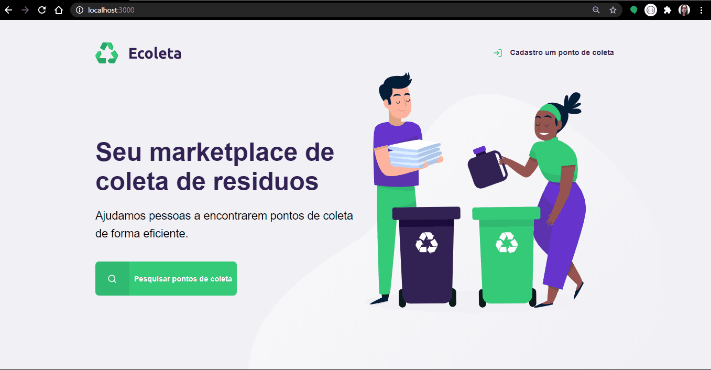

<h2 align="center">
    
    <br>
    <b> Ajudamos pessoas a encontrarem pontos de coleta de forma eficiente.</b> 
    </br>
</h2>

<h1>
    
</h1>


## 📋 Índice

- [Sobre](#sobre)
- [Tecnologias Utilizadas](#tecnologias-utilizadas)
- [Baixar o projeto](#baixar-projeto)
- [Rocketseat](#rocket-seat)

---
<a id="sobre"></a>
## 🔖 Sobre

O <strong>Ecoleta</strong> é uma aplicação Web e Mobile para ajudar pessoas a encontrarem pontos de coleta para reciclagem.

Essa aplicação foi construída na <strong>semana do meio ambiente</strong> em um projeto da [Rocketseat](https://rocketseat.com.br/) a <strong>Next Level Week</strong>. A ideia era criar uma aplicação voltada ao meio ambiente.

---

<a id="tecnologias-utilizadas"></a>
## 💻 Tecnologias Utilizadas

O projeto foi desenvolvido utilizando as seguintes tecnologias

- [TypeScript](https://www.typescriptlang.org/)
- [Node.js](https://nodejs.org/en/)
- [ReactJS](https://reactjs.org/)
- [React Native](https://reactnative.dev/)

---

## 📂 Baixar o projeto
<a id="baixar-projeto"></a>

### **Pré-requisitos**

  - É **necessário** possuir o **[Node.js](https://nodejs.org/en/)** instalado na máquina.
  - Também, é **preciso** ter um gerenciador de pacotes seja o **[NPM](https://www.npmjs.com/)** ou **[Yarn](https://yarnpkg.com/)**.


```sh
    #Clonar o respositório.
  $ git clone https://github.com/steephanie

    # Instale as dependências.
  $ npm install

    # Inicie a aplicação.
  $ npm start
```

---

<a id="rocket-seat"></a>
## 🚀 Rocketseat 

A [Rocketseat](https://rocketseat.com.br/) tem as melhores tecnologias em programação que são direto ao ponto e do jeito certo.


<h4>
    
     <br> Starter - Cursos 100% online para você dar o próximo passo na sua evolução como programador. E o melhor, de graça!</br>
</h4>

<h4>
    
    <br> Bootcamp - Treinamentos imersivos para dominar as tecnologias mais modernas no menor tempo possível. </br>
</h4> 

---

<h5 align="center">
    Feito com 💜 by <a href="https://www.linkedin.com/in/stephanie-nascimento-71ab51152/" target="_blank">Stephanie Nascimento</a>
</h5>
